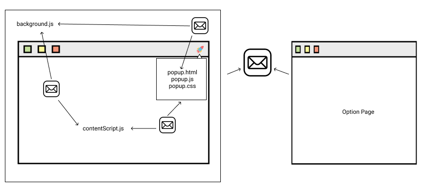

# "Chrome Extension Template" Documentation

Thank you for using Chrome Extension Template.

### Big Picture

Here how Chrome Extension life cycle looks like



### File Structure

```
extension
└─── _locales
    └─── en
          |── messages.json
└───contentScript/webAccessibleResources
└───css
    │── content.css
    │── option.css
    │── popup.css
└───js
    │── background.js
    │── contentScript.js
    │── options.js
│── options.html
│── popup.html
│── messages.json
```

### Quick start

[Install](install.md)
