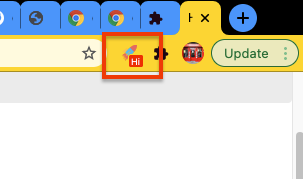

# Background (background.js)

## How to listen if the extension is installed/updated

User `chrome.runtime.onInstalled.addListener`

```javascript
chrome.runtime.onInstalled.addListener(function (details) {
  if (details.reason == 'install') {
    console.log('onInstalled listener > extension is installed');
    //you can open a new link, open options page, set badge text etc.
    chrome.tabs.create({url: `chrome-extension://${chrome.runtime.id}/options/options.html`});
    ...
  } else if (details.reason == 'update') {
    console.log('onInstalled listener > extension is updated');
    //you can open a new link, open options page, set badge text etc.
    chrome.tabs.create({url: `chrome-extension://${chrome.runtime.id}/options/options.html`});
    ...
  }
});
```

## How to open a url when the extension is uninstalled

```javascript
chrome.runtime.setUninstallURL(`[URL]`);
```

## How to open a new tab in background.js

```javascript
chrome.tabs.create({
  url: 'https//www.google.com',
});
```

## How to set badge background color and text

Don't forget to register Browser Action in manifest.json

```json
...
"browser_action": { "default_title": "Chrome Template" },
...
```

```javascript
//set text
chrome.browserAction.setBadgeText(details: object, callback: function);
//sample
chrome.browserAction.setBadgeText({ text: 'Hi' }, function(){...});
//sample to clear badge
chrome.browserAction.setBadgeText({ text: '' }, function(){...});

//set background color
chrome.browserAction.setBadgeBackgroundColor(details: object, callback: function);
//sample
chrome.browserAction.setBadgeBackgroundColor({color: '#f00'}, function(){...});
```



## How to listen message in background.js

```javascript
//background.js >> add listener
chrome.runtime.onMessage.addListener(function (message, sender, sendResponse) {
  switch (message.type) {
    ...
    case 'setBadgeText':
      ...
      //set badge
      chrome.browserAction.setBadgeText({ text: message.data });
      break;
    ...
  }
});
```

## How to save an object into storage

First of all you must add storage permission in manifest.json file

```json
//manifest.json
{
...
"permissions": [ "storage" ],
...
}
```

then, in javascript file

```javascript
chrome.storage.sync.set({ key: value }, function () {
  console.log('Value is set to ' + value);
});
chrome.storage.sync.get(['key'], function (result) {
  console.log('Value currently is ' + result.key);
});
```
