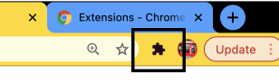
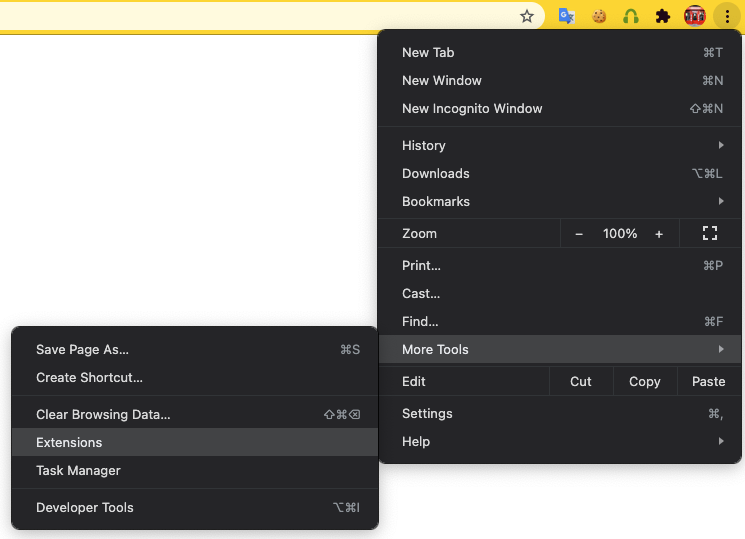
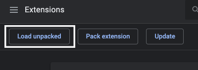
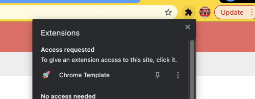

# Install Chrome Extension

You will find the extension package under the "extension" folder.

1- Open Chrome browser. Click on Manage Extensions icon on right top corner.

or More Tools > Extensions

2- Click on "Load unpacked", select the folder "extension" you downloaded.

3- The extension will be installed and ready to use immediately. To keep the extension in the bar, Click "Extensions" and click on the pin icon.

Let's start reviewing the codes in the extension

### [Manifest](manifest?id=manifest-manifestjson)
### [Option Page](options?id=options-page)

### [Background Script](background?id=background-script)

### [Content Script](content?id=content-script)

### [Popup Page](popup?id=popup-page)
